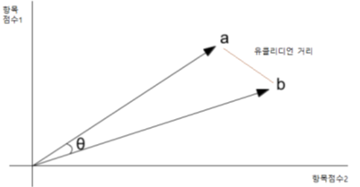

독립변수(X변수) 만의 변수들만 활용 하여 군집과 분류 하게됨.

### 군집의 방법 및 프로세스

1. 유사도의 측정 원리는 Vector를 활용하여 거리를 측정하게 됨
2. 텍스트 마이닝에서는 문서의 토큰화된 것에 대하여 CountVectorizer, TfidfVectorizer, Word2Vec 등으로 벡터화 시킴
3. 벡터화 된것을 활용 하여 유사도를 측정 하게됨
  * 벡터화 방법은 TDF, TD-IDF, 주제어 적인 방법 등으로 변환

  * 유틀리디안 유사도 : 두 문서 벡터의 상대적 거리차를 측정 - 0 에 가까울 수록 유사한 방식이다  
    $$  \sqrt{ \sum_{f=1}^p (x_{if} - x_{jf})^2 }  $$ 

    

  * 코사인 유사도: 두 문서가 같게되면 $\Theta$ 는 0이됨   
    - 두 벡터의 각도를 활용 하여 유사도를 측정하게 됨
    - 유클리디언 차이점 : 코사인의 각도는 동일해도 원점에서 멀어질 수록 유클리디언 거리는 커지게 됨
      * 즉, 빈도가 늘어나게 되면 유클리디언 거리는 커지지만 코사인 각도는 동일하게 됨

        $$  x  \bullet  y =  \| x\|  \| y\|  cos \Theta   $$  
        $$  cos\Theta   =  \frac{  x  \bullet  y}{  \| x \| \| y \| }  =   \frac{ \sum_{i=1}^{n} { x_{i}  \times x_{j} } }  { \sqrt { \sum_{i=1}^n x_{i}^2 } \sqrt { \sum_{i=1}^n y_{i}^2 } }$$
        

4. 3단계(군집)에서는 Clustering 하게됨
    - 비계층적 방법 대표 : K-means
    - 계층적 방법
      - 단일링크 클러스터링(single), 완전링크 클러스터링(complete), 평균링크 클러스터링(average), 워드 링크법(ward)

### 파이썬 활용 유사도 계산

* 아래와 같이 벡터화 된 문서의 경우 ( ※ https://wikidocs.net/24603 참고)

    |-|바나나|사과|저는|좋아요|
    |--|--|--|--|--|
    |문서1|0|1|1|1|
    |문서2|1|0|1|1|
    |문서3|2|0|2|2|

1. 유클리디언 유사도 계산
    <pre>
        # 유클리디언

        import numpy as np

        def dist(x,y):
            return np.sqrt(np.sum((x-y)**2))

        doc1=np.array([0,1,1,1]) # 문서1의 단어 벡터
        doc2=np.array([1,0,1,1]) # 문서2의 단어 벡터
        doc3=np.array([2,0,2,2]) # 문서3의 단어 벡터

        docQ = np.array((1,1,0,1))
        print(dist(doc1,docQ))
        print(dist(doc2,docQ))
        print(dist(doc3,docQ))
    </pre>

2. 코사인 유사도 계산 
    
    <pre>
        # 코사인
        from numpy import dot
        from numpy.linalg import norm
        import numpy as np

        def cos_sim(A, B):
            return dot(A, B)/(norm(A)*norm(B))

        doc1=np.array([0,1,1,1]) # 문서1의 단어 벡터
        doc2=np.array([1,0,1,1]) # 문서2의 단어 벡터
        doc3=np.array([2,0,2,2]) # 문서3의 단어 벡터

        print(cos_sim(doc1, doc2)) #문서1과 문서2의 코사인 유사도
        print(cos_sim(doc1, doc3)) #문서1과 문서3의 코사인 유사도
        print(cos_sim(doc2, doc3)) #문서2과 문서3의 코사인 유사도

        import numpy as np
        from sklearn.metrics.pairwise import cosine_similarity

        matx = np.vstack([doc1, doc2, doc3])
        cosine_similarity(matx)
    </pre>

3. 자카드 유사도 : 교집합의 토큰 개수 / 합집합 [유니크한 집합] 토큰의 개수 로 유사도를 표현하게 됨
   
    <pre>   
        #자카이드 유사도 계산
        #공통 등장한 단어는 'radio', 'computer', 'like'
        doc1 = "radio computer everyone like likey watch card holder"
        doc2 = "radio computer coupon passport like you"

        # 토큰화를 수행합니다.
        tokenized_doc1 = doc1.split()
        tokenized_doc2 = doc2.split()

        # 토큰화 결과 출력
        print(tokenized_doc1)
        print(tokenized_doc2)

        # 문서1과 문서2의 합집합
        union = set(tokenized_doc1).union(set(tokenized_doc2))
        print(union)

        # 문서1과 문서2의 교집합
        intersection = set(tokenized_doc1).intersection(set(tokenized_doc2))
        print(intersection)

        # 자카드 유사도 = 교집합의 수를 합집합의 수로 나누기
        print(len(intersection)/len(union))   
    </pre>

### 클러스터링 방법

1. 비계층적 클러스터링
   - K-means 클러스터링 
     - 비계층적 클러스터링 (계층적-Hierarchical 방법이 아님)
     - 개체 수가 증가하게 되면 유용하지 못함
     - k개수를 정함이 분석자 마다 다름
     - 알고리즘
       * Step1) n개의 개체를 미리 k개의 클러스터로 나누고 클러스터 중심을 계산
       * Step2) 각 개체와 클러스터 중심과의 거리를 계산(제곱합)
       * Step3) 각 개체의 거리가 가장 짧은 클러스터에 분류
       * Step4) 더 이상의 클러스터가 없을때 까지 반복 실행

2. 계층적 클러스터링 (Hierarchical 방법) : 
    - Dendogram 형태로 그려짐 : <a href="../../clustering/Clustering-theory/#군집분석-유형--major-clustering-approaches-">상세보기</a>
