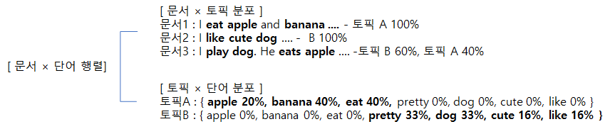

토픽모델이란 문서와 단어로 구성된 행렬(Document Term Matrix)를 기반으로 문서에 잠재된 토픽의 등장확률을 추정하는 기법으로 분석결과를 직관적이고 정교하게 보여주게 된다.
즉 토픽과 단어의 확률 분포를 바탕으로 새로운 문서를 생성하기 때문에 생성모델 이라고도 한다.
이 분석의 목적은 해석하는 사람마다 다른 텍스트 마이닝을 해소하기 위해 사용할 수 있다

### 토픽모델링 기법

* 토픽 : 등장할 확률이 높고 유사한 의미를 가지는 단어들의 집합
* 텍스트 데이터 내 단어들의 빈도를 통계적으로 분석하여 전체 데이터를 관통하는 잠재적 주제, 즉 토픽들을 자동으로 추출 분류 하게됨
* 토픽의 의미는 자의적이기 때문에 해석에 유의해야 한다.
* 토픽의 수는 패키지를 이용하는 방법도 있지만 최적의 연구자의 추론을 바탕으로 선택하는 것이 적절하다.
* 기법은 LDA(Latent Dirichlet Allocation) , CTM(Correlated TopicModel), STM(Structural Topic Model) ,  BTM(Biterm Topic Model) 등이 있다.
* LDA는 토픽이 서로 독립을 가정하고, CTM,STM은 상호연관을 가정하고 있다.
* 응용분야는 텍스트 요약, 추천 시스템, 스팸 필터 등에 적용되고 있다.

### 토픽모델링의 문서 생성과정
1. 문서에 대한 토픽의 개수 및 구성비율 결정
2. 문서에 포함될 단어의 개수 결정
3. 문서에 포함될 단어를 발생활률에 따라 각 토픽으로 부터 반복 추출
4. 추출된 단어로 문서를 완성

### 토픽모델링 LDA Topic Modeling
* 대량의 문서에서 유사한 의미를 가진 단어들을 집단화 하는 방법으로 추론 하는 방법
* Latent 즉 잠재정보를 알아내는 과정 이다.
* LDA가 토픽을 찾는 방법
  
    

    * LDA를 통하여 과정이 수행되고 나면 
  
    * 각 문서는 어떤 토픽으로 구성되어 있는지 알 수 있음
      위 경우 문서 1은 100% 토픽 A, 문서2는 100% 토픽 B, 문서 3은 6:4로 토픽A,B가 구성

    * 각 단어가 토픽에서 차지하는 구성을 알 수 있음

* LDA가 알고리즘 절차

    <pre>
    1) 토픽의 개수 K 결정
    </pre>

    - 먼저 토픽의 개수를 연구자가 결정한다.

    <pre>
    2) 단어를 토픽과 무작위로 연결시키는 작업을 수행 - 모든 단어를 K개 중 하나의 토픽으로 할당하게 됨
    </pre>
    - 이과정은 모든 단어를 랜덤으로 K개의 토픽에 할당 되었기 때문에 결과는 전부 틀린 상태 임

    <pre>
    3) 모든 문서의 모든 단어에 대해 아래사항을 반복 진행(Iterative)

        1. Pr(토픽t|문서d)×Pr(단어w|토픽t)의 확률로 소속 토픽 업데이트

           - 어떤 문서의 각 단어 w는 잘못된 토픽에 할당되었지만, 다른 단어들은 올바른 토픽에 할당된 상태라고 가정함.
           - Pr(토픽t|문서d) : 문서(d)의 단어(w)들 중 토픽에 해당하는 단어(w)들의 비율 -- A
           - Pr(단어w|토픽t) : 각 토픽(t)들 에서 해당 단어(w)의 분포 -- B
           - Pr(토픽t|문서d)×Pr(단어w|토픽t) : 문서(d)에서 토픽(t)가 단어(w) 생성 비율 -- C

        2. 반복하면, 모든 할당이 완료된 수렴 상태가 됨
    </pre>
    - A 기준은 토픽에 편중현상이 생기지만, B 기준은 A의 편중현상을 완화시키게 된다.

    <pre>
    4) 최종 토픽 할당
    </pre>    
    - 최종적으로 각 문서의 토픽 구성과 각 단어가 토픽에서 차지하는 구성을 알 수 있음

* LDA 실습 예제
<pre>
###### 5개 topic 으로 하여 LDA 모델을 학습 예제 (texts : 전처리 된 document)

### 1. 정수 인코딩과 단어 집합 만들기 
# create a Gensim dictionary from the texts
from gensim import corpora
dictionary = corpora.Dictionary(texts)
list(dictionary)

# remove extreme words (similar to the min/max df step used when creating the tf-idf matrix)
dictionary.filter_extremes(no_below=1, no_above=0.8)

# convert the dictionary to a bag of words corpus for reference
corpus = [dictionary.doc2bow(text) for text in texts]
len(corpus)

# 2. LDA 
import gensim
NUM_TOPICS = 5
ldamodel = gensim.models.ldamodel.LdaModel(corpus, num_topics = NUM_TOPICS, id2word=dictionary, passes=15)
topics = ldamodel.print_topics(num_words=4)
for topic in topics:
    print(topic)

</pre>

* LDA 시각화
LDA 시각화를 위해서는 pyLDAvis의 설치가 필요

<pre>
import pyLDAvis.gensim_models

pyLDAvis.enable_notebook()
vis = pyLDAvis.gensim_models.prepare(ldamodel, corpus, dictionary)
pyLDAvis.display(vis)
</pre>